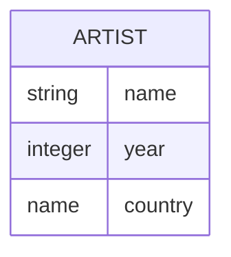
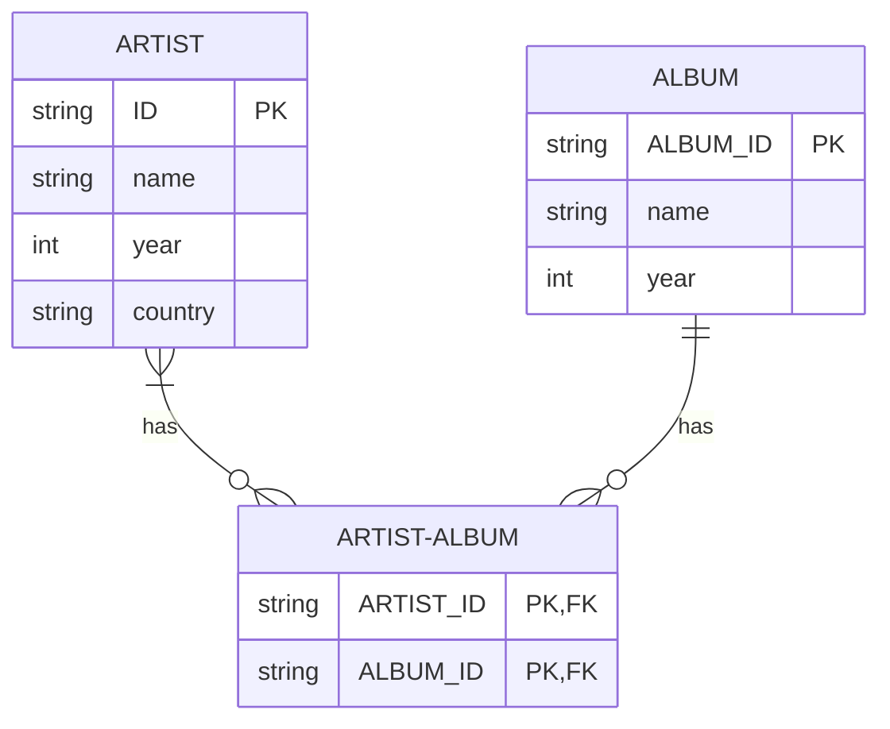

---
started:
  - done
---
## Resources
| What | Link |
| ---- | ---- |
| PDF Slides | [https://15445.courses.cs.cmu.edu/fall...](https://www.youtube.com/redirect?event=video_description&redir_token=QUFFLUhqbVJ2dGlBcTNsMVhmaW5GWnZGcUdwSU5JQ3Zld3xBQ3Jtc0tuUGFLcUhmdnRLZ3BsclZpdzNGQmFnM1hKNWw1LVBoNUNvWkdFY0R0TGt0bHY4SHQtZVZ1ZnF3bDlxWnhxYWxsclBvcGVFd2RzZkVpbW9IRXUtME9MNkI2WmtZN0J1MHFwUHc3Y1lLTkRJTy1oMkZaSQ&q=https%3A%2F%2F15445.courses.cs.cmu.edu%2Ffall2023%2Fslides%2F01-relationalmodel.pdf&v=XGMoq-D_mao) |
| PDF Notes | [https://15445.courses.cs.cmu.edu/fall...](https://www.youtube.com/redirect?event=video_description&redir_token=QUFFLUhqbG5EMDlLU0RRTUlNV3JhUGlpYXhsbTl1X2ptQXxBQ3Jtc0tsQWc2SFZfUnhqLVhMbWotbXJkLXozZHU0OHVQUlF3YlNGOTFkSTE2RjJ1QVlxbUQwWVBkS0s1YUJXYmNSUjhubGl3VHJOX0RRWU8yUU5UMHN0aFQyUi1hUTVzSEJSOU52WV9GRGZLeW42Yk9zcUxLNA&q=https%3A%2F%2F15445.courses.cs.cmu.edu%2Ffall2023%2Fnotes%2F01-relationalmodel.pdf&v=XGMoq-D_mao) |
| Youtube Link | [Youtube Link](https://www.youtube.com/watch?v=uikbtpVZS2s&t=7s) |

# Database Basics


Collection of inter-related data that models the real-world

## CSV as Database

Store data as CSV
Every entity is a separate file which can be queries from a Pythin Script

Example

```csv
Artist(name,year,country)
"Wu Tang Clan",2018,"SCAM"
"21",2011,"England"

```


```python
for line in file.readlines()
	record = parse(line)
	if(record[0] === "21")
		print(int(record[1]))
```


### Disadvantages

- Data Integrity
- Durability
- Querying is linear and does not scale
- No metadata on the schema
- Multi-threading not possible on file level


# Enter DBMS


- DBMS is a software to store (safely), analyze (efficiently) information
- DBMS should support these according to some **data model**:
	- Creation
	- Querying
	- Updation
	- etc...


### Data Model vs Schema


| What | Data Model | Schema |
| ---- | ---- | ---- |
| Description | Collection of concepts to describe data in DB | Description of particular collection of data using a *data model* |
| Example | - Relational (Most Databases)<br>- Key/value (Redis)<br>- Document/Object (Mongo/S3)<br>- Graph (Neo4j)<br>- Wide-column/ Column family(OLAP, Snowlake etc)<br>- Array/Matrix/Vector (LLM Apps)<br>- Hierarchal (Legacy)<br>- Network (Legacy)<br>- Multivalue (Legacy) |  |

# Database history

- Started in 1960s
- Examples: IDS, IMS, CODASYL

Tight coupling between logical & physical layers. What this means if you change the underlying structure of DB, then application code also changes. 

Ted Codd devised **relational model** in 1969 ([See paper here](https://www.seas.upenn.edu/~zives/03f/cis550/codd.pdf)) to solve the above issue of reimplementation of programs according to DB implementations @ IBM. This was a radical idea at the time, but it is now the norm.


# Relational Model

> Goal: Define a DB abstraction based on **relations** to avoid maintainence


Key points:
- Store DB in simple Data structure
- Physical storage left upto DBMS
- Access data through a high-level language (SQL became the de-facto language); whilst the DBMS figures out best execution strategy to the queries.


**Relation**: aka Entity aka Table 
> Defn: Unordered set that contain the relationship of attributes (columns) that represent entities 

**Tuple** : aka Row aka Domain
> Defn: Set of attribute values





3 Goals of Relational Model:
1. **Structure**: Definition of DB's relation and their contents
2. **Integrity**: Ensure DB's contents satisfy constraints
3. **Manipulation**: An API for accessing and modifying DB's contents

### Primary Key

> Uniquely identify a single tuple.row


Different SQL standards for generating Primary Keys
1. `SEQUENCE` (SQL:2003)
2. `AUTO_INCREMENT` (MySQL)
3. ... TODO other dbs like Postgres, Oracle


## Foreign Key

> Identify identifier to different table





# Data Manipulation Language


### Procedural

> Using DBMS techniques to find results


PLSQL or some underneath DB mechanism


### Non-Procedural (declarative)
> SQL


# Relational Algebra

> Based on sets and bags

| Type | What | Syntax | SQL |
| ---- | ---- | ---- | ---- |
| Select | Selecting data based on predicate | σa id=’a2’(R) | `SELECT * FROM R WHERE a_id = 'a2'` |
| Projection | Filter out tuples based on criteria  | πb id-100, a id(σa id=’a2’(R)) | `SELECT b_id-100, a_id FROM R WHERE a_id = 'a2'` |
| UNION | Combine all relation as a single relation.  | (R ∪ S) | `(SELECT * FROM R) UNION ALL (SELECT * FROM S)` |
| INTERSECTION Note: The two input relations have to have the exact same attributes. | Intersection takes in two relations and outputs a relation that contains all tuples that appear in both of the input relations.  | (R ∩ S) | `(SELECT * FROM R) INTERSECT (SELECT * FROM S)` |
| Difference    Note: The two input relations have to have the exact same attributes. | Difference takes in two relations and outputs a relation that contains all tuples that appear in the first relation but not the second relation. Note: The two input relations have to have the exact same attributes. | (R − S) | `(SELECT * FROM R) EXCEPT (SELECT * FROM S)` |
| Product<br>Note: No need to have same attribute | Product takes in two relations and outputs a relation that contains all possible combinations for tuples from the relations. | (R × S) | `(SELECT * FROM R) CROSS JOIN (SELECT * FROM S)` or simply `SELECT * FROM R, S`l |
| JOIN<br>Note: No need to have same attribute | Join takes in two relations and outputs a relation that contains all the tuples that are a combination of two tuples where for each attribute that the two relations share, the values for that attribute of both tuples is the same. | (R ▷◁ S) | `SELECT * FROM R JOIN S USING (ATTRIBUTE1, ATTRIBUTE2...)` |

Other operators
1. Rename
2. Assignment
3. Duplicate elimination
4. Aggregation
5. Sorting
6. Division


> Relational Model is independent of any query language implementation at the database level. Example; Postgres and MySQL does Query plans, Query optimizer in different ways. Relational model has nothing to do with this.


 
